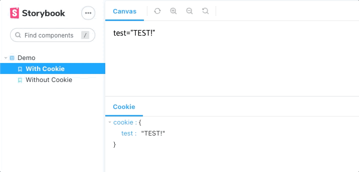

<div align="center">

  <h1>Storybook Addon Cookie</h1>

  <picture style="display: flex; flex-direction: column; align-items: center;">
    
  </picture>

  <br />
  <p>
    This addon sets <code>document.cookie</code> for individual stories, helping you test your components' use of cookies in isolation.
  </p>

  <p>
    
    <a href="https://github.com/storybook-community/storybook-addon-cookie/commits"></a>
    <a href="https://github.com/storybook-community/storybook-addon-cookie/commits"></a>
    <a href="https://github.com/storybook-community/storybook-addon-cookie/issues/"></a>
    <a href="https://github.com/storybook-community/storybook-addon-cookie/actions/workflows/continuous-integration.yml"></a>
    <a href="https://github.com/storybook-community/storybook-addon-cookie/graphs/contributors"></a>
    <a href="https://github.com/storybook-community/storybook-addon-cookie/blob/main/CODE_OF_CONDUCT.md"></a>
    <a href="https://github.com/storybook-community/storybook-addon-cookie/blob/main/LICENSE"></a>
    <a href="https://github.com/storybook-community/storybook-addon-cookie/network/members"></a>
    <a href="https://github.com/storybook-community/storybook-addon-cookie/stargazers"></a>
  </p>
</div>


<p align="center">
  
</p>

> [!NOTE]
> This is a fork maintained by the community to provide support for Storybook 10 and beyond. This addon was originally developed by 김현우 (Kim HyunWoo).

------

## Install

### Install addon

Install the addon:

```sh
npm i -D @storybook-community/storybook-addon-cookie
```

Load the addon in your Storybook config:

```ts
// .storybook/main.ts
export default {
  addons: [
    // ..other addons
    '@storybook-community/storybook-addon-cookie',
  ],
};
```

## Usage

You can preset a cookie object through the `cookie` [parameter](https://storybook.js.org/docs/writing-stories/parameters). Each story has independant cookies, even if they are set via a global or component parameter.

You can manually edit or input a cookie object in the 'Cookie' addon panel. Those changes are not preserved on reload.

```tsx
export default {
  component: Example,
  title: 'Example',
}


export const WithCookie = {
  parameters: {
    cookie: {
      prop: 'value',
    },
  }
}
```


### Cookie encoding


If you want to encode the value of cookies you've set in `parameters` or in the panel, you can use the `cookieEncoding` parameter. This can be done globally, per-component or per-story.

```jsx
export const WithEncodedCookie: Story = {
  parameters: {
    cookie: {
      prop: 'value',
    },
    cookieEncoding: true,
  },
};
```

This option defaults to `false`.

### Preserve existing cookies

If you want to use cookies that existed prior to loading the story, on top of those defined in `parameters`, you can set the `cookiePreserve` parameter.

```tsx
export const PreserveCookies: Story = {
  parameters: {
    cookie: {
      prop: 'value',
    },
    cookiePreserve: true,
  },
};
```

This option defaults to `false`.

> [!CAUTION]
> If you modify a cookie in stories that do not have `cookiePreserve`, its value will be modified for all stories that use `cookiePreserve` that are subsequently loaded. Avoid mixing cookies between stories that do and don't preserve them.

> [!CAUTION]
> If all your stories use `cookiePreserve`, and one story does not set a cookie, that story will inherit the value of the last loaded story that did set a value for it.

> [!TIP]
> If you want some cookies to always be set for all stories, it is preferable to set them globally in `parameters` in `.storybook/preview.ts`. This guarantees absence of issues from the order in which you load stories.

```ts
// .storybook/preview.ts

export default {
  parameters: {
    cookie: {
      globallyShared: 'value',
    },
  },
};
```

## Previous Storybook versions

* Storybook 9: unsupported
* Storybook 6-8: use `storybook-addon-cookie` from [hwookim](https://github.com/hwookim/storybook-addon-cookie) instead


## Contributing

### Code of Conduct

Please read the [Code of Conduct](https://github.com/storybook-community/storybook-addon-cookie/blob/main/CODE_OF_CONDUCT.md) first.

### Developer Certificate of Origin

To ensure that contributors are legally allowed to share the content they contribute under the license terms of this project, contributors must adhere to the [Developer Certificate of Origin](https://developercertificate.org/) (DCO). All contributions made must be signed to satisfy the DCO. This is handled by a Pull Request check.

> By signing your commits, you attest to the following:
>
> 1. The contribution was created in whole or in part by you and you have the right to submit it under the open source license indicated in the file; or
> 2. The contribution is based upon previous work that, to the best of your knowledge, is covered under an appropriate open source license and you have the right under that license to submit that work with modifications, whether created in whole or in part by you, under the same open source license (unless you are permitted to submit under a different license), as indicated in the file; or
> 3. The contribution was provided directly to you by some other person who certified 1., 2. or 3. and you have not modified it.
> 4. You understand and agree that this project and the contribution are public and that a record of the contribution (including all personal information you submit with it, including your sign-off) is maintained indefinitely and may be redistributed consistent with this project or the open source license(s) involved.

### Getting Started

This project uses PNPM as a package manager.

- See the [installation instructions for PNPM](https://pnpm.io/installation)
- Run `pnpm i`

### Useful commands

- `pnpm start` starts the local Storybook
- `pnpm build` builds and packages the addon code
- `pnpm pack` makes a local tarball to be used as a NPM dependency elsewhere
- `pnpm test` runs unit tests

### Migrating to a later Storybook version

If you want to migrate the addon to support the latest version of Storyboook, you can check out the [addon migration guide](https://storybook.js.org/docs/addons/addon-migration-guide).

### Release System

This package auto-releases on pushes to `main` with [semantic-release](https://github.com/semantic-release/semantic-release). No changelog is maintained and the version number in `package.json` is not synchronised.

## Support

Please [open an issue](https://github.com/storybook-community/storybook-addon-cookie/issues/new) for bug reports or code suggestions. Make sure to include a working Minimal Working Example for bug reports. You may use [storybook.new](https://new-storybook.netlify.app/) to bootstrap a reproduction environment.

## Contact

Steve Dodier-Lazaro · `@Frog` on the [Storybook Discord](https://discord.gg/storybook)

Project Link: [https://github.com/storybook-community/storybook-addon-cookie](https://github.com/storybook-community/storybook-addon-cookie)

## Acknowledgments

### Thanks

- [김현우 (Kim HyunWoo)](https://github.com/hwookim) for developing the original addon
- All the contributors to the [Storybook addon kit](https://github.com/storybookjs/addon-kit)